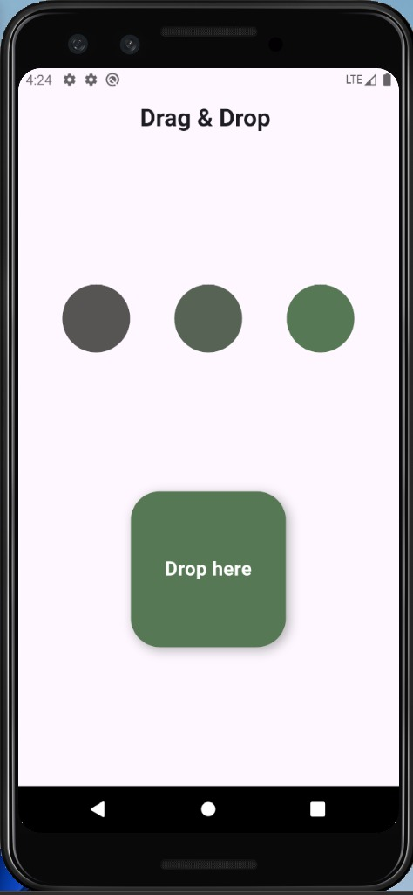

#  Drag & Drop 

This Flutter project demonstrates how to use **drag-and-drop interactions** with colorful draggable circles and a drop target box that smoothly changes color.  

---

### 🔹 `ColorDraggable` Widget
- **Type:** `StatelessWidget`  
- Represents a reusable circle that can be dragged.  
Built with `Draggable<Color>`:
  - **child** → The normal circle view.  
  - **feedback** → The widget shown while dragging.  
  - **childWhenDragging** → The widget that stays in place (faded) while the circle is being dragged.  

---

### 🔹 `DragTarget`
- Represents the drop area (the box).  
- **onAccept** → Updates the box color to the dropped circle’s color.  
- Uses **AnimatedContainer** for smooth color transitions.  

---

## 🧩 Core Widgets

### 🔹 `Draggable`
The draggable item (in this case, the colored circle).  
- **child** → The widget that appears normally.  
- **feedback** → The widget shown when dragging (moves with your finger).  
- **childWhenDragging** → The widget left behind when the item is being dragged.  

---

### 🔹 `DragTarget`
The widget that can receive dragged items.  
- **onAccept** → Triggered when an item is dropped.  
- **onWillAccept** → Decides whether the target should accept the dragged item or not.  

---

### 🔹 `LongPressDraggable`
Almost the same as `Draggable`, but dragging only starts **after a long press**.  

---

## 📂 File Structure

-  lib/
-   └── home.dart
-  assets/
-   └── screenshot.png

---

## 📷 Screenshot

